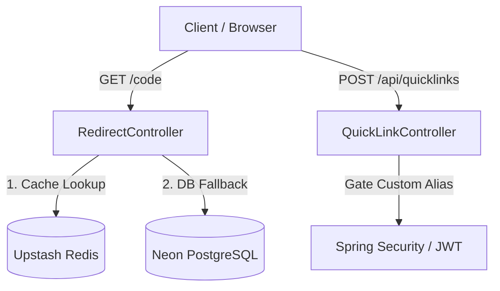

# QuickLink ⚡
> A high-performance, stateless, serverless-optimized URL shortener and QR generator backend built on **Spring Boot**, **PostgreSQL (Neon)**, and **Redis (Upstash)**.

QuickLink provides lightweight URL shortening with automatic sub-50ms cache resolution, AOP execution logging, JWT-gated custom aliases, and automatic API documentation.

---

## 🛠️ System Architecture & Tech Stack



* **Core Engine:** Java 17 / Spring Boot 3.x (stateless architecture)
* **Security & Auth:** Spring Security 6 + stateless JWT bearer authentication (`com.auth0:java-jwt`)
* **Persistence Layer:** Spring Data JPA + Hibernate 6 on **Neon Serverless PostgreSQL**
* **Caching Layer:** Spring Data Redis on **Upstash Serverless Redis** (sub-50ms cache hits)
* **QR Engine:** Google ZXing (Zebra Crossing) for real-time vector image generation
* **API Documentation:** OpenAPI 3 / Swagger UI via `springdoc-openapi`
* **Performance Monitoring:** AspectJ AOP (custom logger capturing execution time metrics)
* **Cleanup Engine:** Daily `@Scheduled` cron worker managing database garbage collection

---

## ⚡ Performance Benchmarks

* **DB-Direct Redirect Lookup (Cold):** `~500ms - 600ms`
* **Redis Cache Hit (Warm):** `~30ms - 50ms` (Over 10x latency reduction)

---

## ⚙️ Configuration & Environment Setup

QuickLink manages secrets using a stateless `.env` configuration imported directly into the Spring runtime context.

Create a `.env` file in the root of the project:

```ini
# Neon PostgreSQL Datasource
DB_URL=jdbc:postgresql://<neon-db-url>/neondb?sslmode=require
DB_USER=neondb_owner
DB_PASSWORD=<neon-password>

# Upstash Redis Cache
REDIS_URL=<upstash-redis-endpoint>
REDIS_PORT=6379
REDIS_PASSWORD=<upstash-redis-password>
```

---

## 🛡️ Database Optimization & Indexes

To keep queries fast as link logs grow, the schema utilizes optimized B-Tree indexes:
1. `idx_code_unique` on `quick_link(code)` – guarantees instant O(1) resolution during redirection lookups.
2. `idx_user_username` on `quick_user(username)` – ensures fast authentication queries.

---

## 📍 API Reference

### 1. Public Redirection
* **`GET /{code}`**
  * Redirects (302 Found) the browser to the destination target URL.
  * *Optimized Flow:* Resolves from Redis first. On cache miss, queries DB, registers hit async, writes back to Redis cache (30-min TTL), and redirects.

### 2. URL Shortening
* **`POST /api/quicklinks`**
  * Shortens a target URL.
  * **Payload:**
    ```json
    {
      "url": "https://example.com",
      "alias": "customBrand",   // Optional, requires JWT Auth
      "expiryDays": 5           // Optional, defaults to 1 day
    }
    ```
  * *Rules:* Anonymous users get a random Base-62 generated string of length 7. Custom aliases require a valid `Authorization: Bearer <token>` header.

### 3. User Authentication
* **`POST /api/auth/register`** – Creates a user, hashes password using BCrypt, and returns a JWT token.
* **`POST /api/auth/login`** – Validates credentials and returns a JWT token.

### 4. QR Code Generation
* **`GET /api/quicklink/qrcode`**
  * Generates and returns a PNG QR code representation of the given text.
  * **Params:** `url` (String), `width` (Int, default 250), `height` (Int, default 250).

### 5. API Documentation
* **Swagger Interactive UI:** `http://localhost:8080/swagger-ui/index.html`
* **Raw OpenAPI Specification:** `http://localhost:8080/v3/api-docs`

---

## 🧹 Expired Links Garbage Collection
An asynchronous cron scheduler runs daily at midnight (`@Scheduled(cron = "@midnight")`) inside [QuickLinkUrlCleanUpService](file:///c:/Users/laxman/projects/QuickLink/QuickLink-Server/src/main/java/com/quicklink/service/QuickLinkUrlCleanUpService.java) to delete expired links and release database storage.
